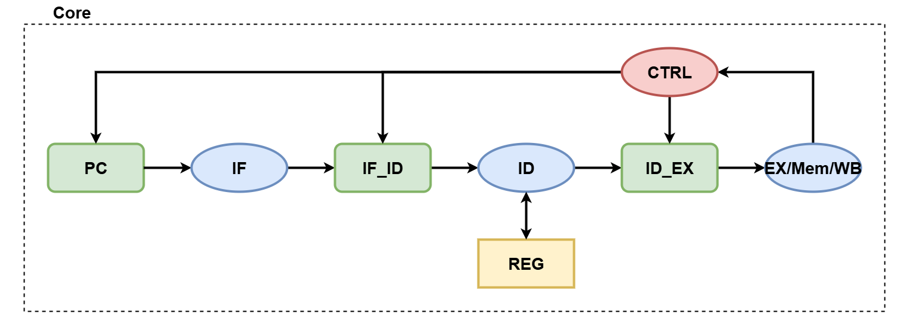
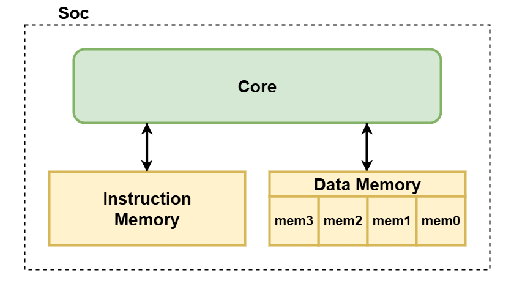

# RISCV_project

3-Stage Pipeline RISC-V CPU (Verilog HDL)

This project implements a modular **3-stage RV32I pipeline core**,
with emphasis on micro-architecture clarity and automated verification.

## Table of Contents

- [Repository Layout](#repository-layout)
- [Architecture](#architecture)
  - [3-Stage Pipeline](#3-stage-pipeline)
  - [System Organization](#system-organization)
    - [Core Architecture](#core-architecture)
    - [SoC Structure](#soc-structure)
- [Implementation Status](#implementation-status)
  - [Implemented](#implemented)
  - [Not Implemented](#not-implemented)
- [Simulation & Verification](#simulation--verification)
  - [Test Result Summary](#test-result-summary)
  - [Detailed Log](#detailed-log)
- [Reference](#reference)

## Repository Layout

```
rtl/
 ├─ core/               # CPU pipeline core modules
 ├─ mem/                # Instruction / Data memory modules
 ├─ soc/                # SoC wrapper
 └─ utils/              # Shared definitions & utilities

sim/
 ├─ compile_and_sim.py  # Compile & run simulation
 ├─ test_all.py         # Regression test for all instructions
 ├─ test_one_inst.py    # Single instruction test
 └─ test_bin/           # Generated test binaries / outputs

tb/
 └─ tb.v                # Top-level testbench

img/
 └─ Architecture diagrams
```

## Architecture

The processor is organized as a 3-stage pipeline core integrated within a simple SoC-level structure.

### 3-Stage Pipeline

```
IF → ID → EX
```

| Stage | Description |
|-------|-------------|
| IF    | Instruction Fetch |
| ID    | Instruction Decode |
| EX    | Execute / Memory / Write Back |

### System Organization

The design separates the processor into two layers:

- **Core** — pipeline datapath and control logic  
- **SoC** — external Instruction Memory and Data Memory integration

#### Core Architecture



#### SoC Structure




## Implementation Status

### Implemented

- ✔ 3-stage pipeline (IF / ID / EX)
- ✔ IF/ID、ID/EX pipeline registers
- ✔ Register File (2R1W)
- ✔ RV32I: R / I / B / J / U-type instructions
- ✔ Load / Store
- ✔ Branch & Jump redirect

### Not Implemented

- Hazard detection / forwarding
- RV32M extension
- FENCE

## Simulation & Verification

The design is validated through automated instruction-level regression tests.


```
cd sim

# Run all instruction tests
python test_all.py

# Run single instruction test
python test_one_inst.py <instruction>  # e.g., addi

```

### Test Result Summary

| Category | Status |
|----------|--------|
| RV32I Arithmetic | PASS |
| Load / Store | PASS |
| Branch / Jump | PASS |
| LUI / AUIPC | PASS |
| RV32M Extension | Not Implemented |

### Detailed Log

```
instruction:  [ add       ]    PASS
instruction:  [ addi      ]    PASS
instruction:  [ and       ]    PASS
instruction:  [ andi      ]    PASS
instruction:  [ auipc     ]    PASS
instruction:  [ beq       ]    PASS
instruction:  [ bge       ]    PASS
instruction:  [ bgeu      ]    PASS
instruction:  [ blt       ]    PASS
instruction:  [ bltu      ]    PASS
instruction:  [ bne       ]    PASS
instruction:  [ fence_i   ]    !!!FAIL!!!
instruction:  [ jal       ]    PASS
instruction:  [ jalr      ]    PASS
instruction:  [ lb        ]    PASS
instruction:  [ lbu       ]    PASS
instruction:  [ lh        ]    PASS
instruction:  [ lhu       ]    PASS
instruction:  [ lui       ]    PASS
instruction:  [ lw        ]    PASS
instruction:  [ or        ]    PASS
instruction:  [ ori       ]    PASS
instruction:  [ sb        ]    PASS
instruction:  [ sh        ]    PASS
instruction:  [ simple    ]    PASS
instruction:  [ sll       ]    PASS
instruction:  [ slli      ]    PASS
instruction:  [ slt       ]    PASS
instruction:  [ slti      ]    PASS
instruction:  [ sltiu     ]    PASS
instruction:  [ sltu      ]    PASS
instruction:  [ sra       ]    PASS
instruction:  [ srai      ]    PASS
instruction:  [ srl       ]    PASS
instruction:  [ srli      ]    PASS
instruction:  [ sub       ]    PASS
instruction:  [ sw        ]    PASS
instruction:  [ xor       ]    PASS
instruction:  [ xori      ]    PASS
instruction:  [ div       ]    !!!FAIL!!!
instruction:  [ divu      ]    !!!FAIL!!!
instruction:  [ mul       ]    !!!FAIL!!!
instruction:  [ mulh      ]    !!!FAIL!!!
instruction:  [ mulhsu    ]    !!!FAIL!!!
instruction:  [ mulhu     ]    !!!FAIL!!!
instruction:  [ rem       ]    !!!FAIL!!!
instruction:  [ remu      ]    !!!FAIL!!!
```

> `mul/div/rem` belongs to the RV32M extension, and is not yet implemented.

## Reference

[1] [SI-RISCV Project](https://github.com/SI-RISCV/e200_opensource.git)
