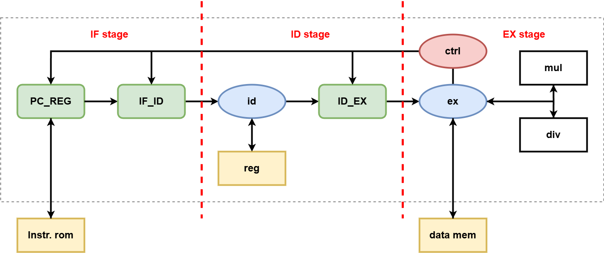
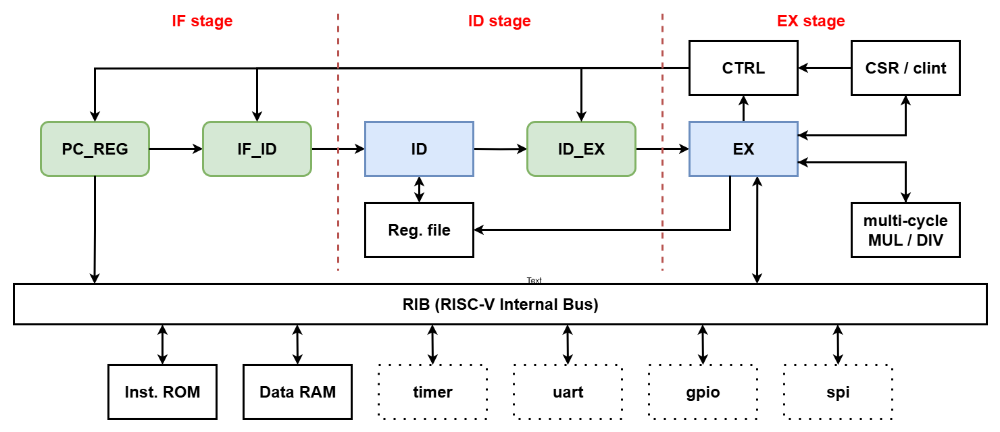

<<<<<<< HEAD
# 3-Stage RV32IM RISC-V CPU

**3-Stage RV32IM Pipeline RISC-V CPU (Verilog HDL)**
=======
# 3-Stage RV32IM Pipeline RISC-V CPU
>>>>>>> e4a083f (modified: modified README.md)


This project implements a modular **3-Stage Pipeline RV32I / RV32M RISC-V CPU (Verilog HDL)**,
with emphasis on micro-architecture clarity and automated verification.


## Table of Contents
- [Repository Layout](#repository-layout)
- [Architecture](#architecture)
  - [3-Stage Pipeline](#3-stage-pipeline)
  - [System Organization](#system-organization)
    - [Core Architecture](#core-architecture)
    - [SoC Structure](#soc-structure)
- [Implementation Status](#implementation-status)
  - [Implemented](#implemented)
  - [Not Implemented](#not-implemented)
- [Simulation & Verification](#simulation--verification)
  - [Test Result Summary](#test-result-summary)
  - [Detailed Log](#detailed-log)
- [Reference](#reference)


## Repository Layout
```
rtl/
 ├─ core/                 # CPU pipeline core modules
 ├─ mem/                  # Instruction / Data memory modules
 ├─ soc/                  # SoC wrapper
 └─ utils/                # Shared definitions & utilities

sim/  
 ├─ compile_and_sim.py    # Compile & run simulation
 ├─ test_all.py           # Regression test for all instructions
 ├─ test_one_inst.py      # Single instruction test
 └─ test_bin/             # RV32I / RV32M regression binaries
 
tb/
 └─ tb.v                  # Top-level testbench

img/
 └─ Architecture diagrams
```


## Architecture
The processor is implemented as a modular 3-stage pipeline core,
decoupled from SoC integration logic.

> Note:
This implementation currently assumes software-managed hazard avoidance.
RAW hazard detection and forwarding logic are reserved for future enhancement.


### 3-Stage Pipeline
```
IF → ID → EX
```

| Stage | Description                   |
|-------|-------------------------------|
| IF    | Instruction Fetch             |
| ID    | Instruction Decode            |
| EX    | Execute / Memory / Write Back |


### System Organization
The processor is organized into two major layers：

- **Core**
- **SoC**


#### Core Architecture


The **Core** contains:

- Pipeline datapath  
- Register file  
- ALU  
- RV32M execution logic  
- Control logic  
- Pipeline registers (IF/ID, ID/EX)  

The Core is responsible for full instruction execution and write-back.


#### SoC Structure


The **SoC layer** integrates:

- Core  
- Instruction ROM
- Data Memory  

It acts as a lightweight wrapper for simulation and testing.


## Implementation Status


### Implemented
- ✔ 3-stage pipeline (IF / ID / EX)
- ✔ IF / ID、ID / EX pipeline registers
- ✔ Register File (2R1W)
- ✔ RV32I：R / I / B / J / U-type instructions
- ✔ Load / Store
- ✔ Branch & Jump redirect
- ✔ RV32M extension (single-cycle MUL/DIV/REM) 


## Not Implemented
- Hazard detection  
- Data forwarding  
- Multi-cycle execution units  
- FENCE / FENCE.I full behavior  


## Prerequisites
Before running the simulation, make sure the following tools are installed：

- **Python 3**
- **Icarus Verilog** (iverilog / vvp)

Optional：
- **GTKWave** (for waveform viewing)

You can verify the installation using:

```
python --version
iverilog -V
vvp -V
```


## Simulation & Verification
The design is validated through automated instruction-level regression tests.

```
cd sim

# Run all instruction tests
python test_all.py

# Run single instruction test
python test_one_inst.py <instruction>  # e.g., addi

```


### Test Result Summary
| Category          | Instruction Type               | Status |
|-------------------|--------------------------------|--------|
| RV32I Arithmetic  | R-type instructions            | PASS   |
| Load / Store      | I-type / S-type instructions   | PASS   |
| Branch / Jump     | B-type / J-type instructions   | PASS   |
| LUI / AUIPC       | U-type instructions            | PASS   |
| RV32M Extension   | Multiply / Divide instructions | PASS   |


### Detailed Log
```
instruction:  [ add       ]    PASS
instruction:  [ addi      ]    PASS
instruction:  [ and       ]    PASS
instruction:  [ andi      ]    PASS
instruction:  [ auipc     ]    PASS
instruction:  [ beq       ]    PASS
instruction:  [ bge       ]    PASS
instruction:  [ bgeu      ]    PASS
instruction:  [ blt       ]    PASS
instruction:  [ bltu      ]    PASS
instruction:  [ bne       ]    PASS
instruction:  [ fence_i   ]    Not Implemented
instruction:  [ jal       ]    PASS
instruction:  [ jalr      ]    PASS
instruction:  [ lb        ]    PASS
instruction:  [ lbu       ]    PASS
instruction:  [ lh        ]    PASS
instruction:  [ lhu       ]    PASS
instruction:  [ lui       ]    PASS
instruction:  [ lw        ]    PASS
instruction:  [ or        ]    PASS
instruction:  [ ori       ]    PASS
instruction:  [ sb        ]    PASS
instruction:  [ sh        ]    PASS
instruction:  [ simple    ]    PASS
instruction:  [ sll       ]    PASS
instruction:  [ slli      ]    PASS
instruction:  [ slt       ]    PASS
instruction:  [ slti      ]    PASS
instruction:  [ sltiu     ]    PASS
instruction:  [ sltu      ]    PASS
instruction:  [ sra       ]    PASS
instruction:  [ srai      ]    PASS
instruction:  [ srl       ]    PASS
instruction:  [ srli      ]    PASS
instruction:  [ sub       ]    PASS
instruction:  [ sw        ]    PASS
instruction:  [ xor       ]    PASS
instruction:  [ xori      ]    PASS
instruction:  [ div       ]    PASS
instruction:  [ divu      ]    PASS
instruction:  [ mul       ]    PASS
instruction:  [ mulh      ]    PASS
instruction:  [ mulhsu    ]    PASS
instruction:  [ mulhu     ]    PASS
instruction:  [ rem       ]    PASS
instruction:  [ remu      ]    PASS
```


## Reference
[1] [SI-RISCV Project](https：//github.com/SI-RISCV/e200_opensource.git)
